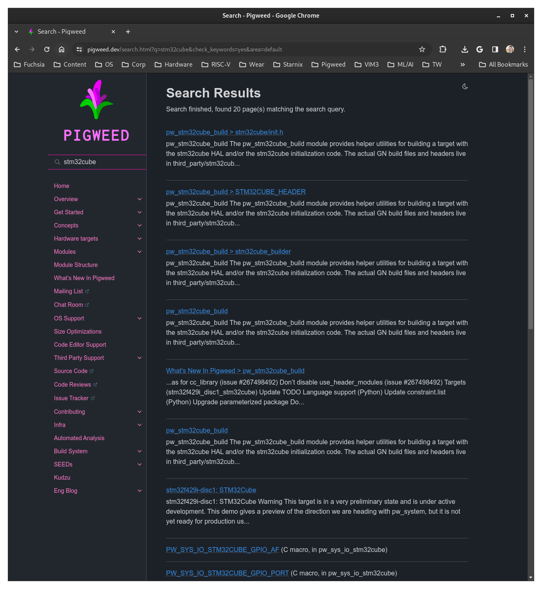

# cube

Experimental repo. I am learning how to create Bazel-based Pigweed projects.
I recently struggled to use the bare metal STM32F429I target in combination
with the STM32Cube HAL library. This repo demonstrates what I tried and where
I struggled.

This repo will probably get archived or deleted in Q2 2024.

## Notes

Notes are ordered chronologically, with the oldest stuff at the bottom. I'll
use H3 sections to make it easier to tell separate ideas apart.

### This is actually my second attempt

In my first attempt I was completely new to Bazel. I will note where I
struggled the most on my first attempt but I think it will be distracting to
look directly at that first attempt

### STM32Cube...?

[stm32f429i-disc1]: https://pigweed.dev/targets/stm32f429i_disc1/target_docs.html
[stm32f429i-disc1: STM32Cube]: https://pigweed.dev/targets/stm32f429i_disc1_stm32cube/target_docs.html

For a long time I actually did not know that STM32Cube was a HAL library.
"Cube" made me think it was a different, cube-shaped development board.
[stm32f429i-disc1] could probably make the purpose of STM32Cube more obvious.

**Takeaway**: Our docs should clearly state what each thing is. E.g. X is the
development board. Y is a HAL for that development board. Etc. It only takes
a few sentences to do and clears up a lot of confusion for any Pigweed users
who aren't familiar with a given manufacturer's hardware/software ecosystem.

### example/echo works

[example/echo]: https://pigweed.googlesource.com/example/echo

Just a quick note to verify that I made sure that [example/echo] works on my
board before attempting these experiments.

### Pulling in STM32Cube

First things first, let's just try to pull in STM32Cube as a dep... How do I do
that? I actually don't remember. Let's search `stm32cube` on `pigweed.dev` and
see what shows up:



[pw_stm32cube_build]: https://pigweed.dev/pw_stm32cube_build

[pw_stm32cube_build] is coming up a lot. Let's try that.

I have to scroll that page for quite a while before I see anything related to
Bazel.

The Bazel section is kinda a wall-of-text. I was hoping for some simple setup
instructions presented as a numbered list.

In the Bazel section I see that I need to set up some other repos as external
deps, but first I'm going to just depend on `pw_stm32cube_build` and see what
happens when I try to build. 

So where do I put the `pw_stm32cube_build` dep? `//src/BUILD.bazel` makes sense
because it's the echo app that will be using the library. But
`//targets/BUILD.bazel` also makes sense because I'll be using the STM32Cube
lib with that library.

**Takeaway**: The `pw_stm32cube_build` should clearly and explicitly show where
to declare the dependency.

I'll just try `//src/BUILD.bazel` first. On my first attempt I tried this:

```
cc_binary(
    name = "echo",
    srcs = ["echo.cc"],
    malloc = select({
        "@platforms//cpu:armv7e-m": "@pigweed//pw_malloc",
        "//conditions:default": "@bazel_tools//tools/cpp:malloc",
    }),
    deps = [
        "@pigweed//pw_boot",
        "@pigweed//pw_sys_io",
        "@pigweed//targets:pw_assert_backend_impl",
        "@pigweed//pw_stm32cube_build",  # new
    ] + select({
        "@platforms//cpu:armv7e-m": [
            "@pigweed//targets/stm32f429i_disc1:basic_linker_script",
            "@pigweed//targets/stm32f429i_disc1:pre_init",
        ],
        "//conditions:default": [],
    }),
)
```

A major point of friction for me on my first attempt: it wasn't clear that
those top-level deps (`pw_boot`, `pw_sys_io`, etc.) will apply to all targets.
In this case both `host` and `stm32f429i`. I don't remember the exact error
but I was basically seeing errors about some assembly instructions being
missing, and I eventually figured out that STM32Cube should only be used within
the "context" of building for an Arm chip. In other words it probably makes
sense to nest the dep like this:

```
cc_binary(
    name = "echo",
    srcs = ["echo.cc"],
    malloc = select({
        "@platforms//cpu:armv7e-m": "@pigweed//pw_malloc",
        "//conditions:default": "@bazel_tools//tools/cpp:malloc",
    }),
    deps = [
        "@pigweed//pw_boot",
        "@pigweed//pw_sys_io",
        "@pigweed//targets:pw_assert_backend_impl",
    ] + select({
        "@platforms//cpu:armv7e-m": [
            "@pigweed//targets/stm32f429i_disc1:basic_linker_script",
            "@pigweed//targets/stm32f429i_disc1:pre_init",
            "@pigweed//pw_stm32cube_build",  # new
        ],
        "//conditions:default": [],
    }),
)
```

OK, let's try to build that last change (`pw_stm32cube_build` nested as a dep
under `@platforms//cpu:armv7e-m`):

```
kayce@kayce0:~/repos/cube$ bazel build //...
ERROR: no such package '@@pigweed//pw_stm32cube_build': BUILD file not found in directory 'pw_stm32cube_build' of external repository @@pigweed. Add a BUILD file to a directory to mark it as a package.
ERROR: /home/kayce/repos/cube/src/BUILD.bazel:18:10: no such package '@@pigweed//pw_stm32cube_build': BUILD file not found in directory 'pw_stm32cube_build' of external repository @@pigweed. Add a BUILD file to a directory to mark it as a package. and referenced by '//src:echo'
Target //:pip_requirements up-to-date (nothing to build)
ERROR: Analysis of target '//src:echo.elf' failed; build aborted: Analysis failed
INFO: Elapsed time: 0.280s, Critical Path: 0.00s
INFO: 1 process: 1 internal.
ERROR: Build did NOT complete successfully
```

On my first attempt it took me a little while to figure out that when you pull in a
dep, that directory needs to have a `BUILD.bazel` file. It was just a minor
friction point though; Bazel's error message helped me figure this out fairly
quickly.

[pw_stm32cube_build source]: https://cs.opensource.google/pigweed/pigweed/+/main:pw_stm32cube_build/
[//third_party/stm32cube]: https://cs.opensource.google/pigweed/pigweed/+/main:third_party/stm32cube/

OK, so if I head over to the [pw_stm32cube_build source] I can verify that
there's no `BUILD` file in that dir. The top of the [pw_stm32cube_build] doc
says that `pw_stm32cube_build` is an alias to [//third_party/stm32cube]... I
guess I need to depend on that other directory instead? Yes, I can see a
`BUILD.bazel` file in there. There's a few `*.BUILD.bazel` files actually.
The stuff about "external dependencies" in the pw_stm32cube_build doc is
starting to make more sense. I see that there's a `BUILD.bazel` for many of the
external deps that the doc mentions.

[//third_party/stm32cube/BUILD.bazel]: https://cs.opensource.google/pigweed/pigweed/+/main:third_party/stm32cube/

In [//third_party/stm32cube/BUILD.bazel] I see a `cc_library` called
`stm32cube`, that seems to be what I need. Let's try that.

```
cc_binary(
    name = "echo",
    srcs = ["echo.cc"],
    malloc = select({
        "@platforms//cpu:armv7e-m": "@pigweed//pw_malloc",
        "//conditions:default": "@bazel_tools//tools/cpp:malloc",
    }),
    deps = [
        "@pigweed//pw_boot",
        "@pigweed//pw_sys_io",
        "@pigweed//targets:pw_assert_backend_impl",
    ] + select({
        "@platforms//cpu:armv7e-m": [
            "@pigweed//targets/stm32f429i_disc1:basic_linker_script",
            "@pigweed//targets/stm32f429i_disc1:pre_init",
            "@pigweed//third_party/stm32cube:stm32cube",  # new
        ],
        "//conditions:default": [],
    }),
)
```

I'm not sure if I need to add `:stm32cube` when the library name matches the
directory name but it's more explicit so I'll just keep it like that.

OK, build attempt:

```
kayce@kayce0:~/repos/cube$ bazel build //...
ERROR: no such package '@@hal_driver//': The repository '@@hal_driver' could not be resolved: Repository '@@hal_driver' is not defined
ERROR: /home/kayce/.cache/bazel/_bazel_kayce/12a041d3d86433b9db8348eb84f223b8/external/pigweed/third_party/stm32cube/BUILD.bazel:36:11: every rule of type label_flag implicitly depends upon the target '@@hal_driver//:hal_driver', but this target could not be found because of: no such package '@@hal_driver//': The repository '@@hal_driver' could not be resolved: Repository '@@hal_driver' is not defined
Target //:pip_requirements up-to-date (nothing to build)
ERROR: Analysis of target '//src:echo.elf' failed; build aborted: Analysis failed
INFO: Elapsed time: 0.247s, Critical Path: 0.00s
INFO: 1 process: 1 internal.
ERROR: Build did NOT complete successfully
```

OK, this is expected. The doc mentions the need for external deps and the
`cc_library` definition also mentioned `:hal_driver` as a dep.

### Pulling in hal_driver

Alright I need to add a dep called `hal_driver` but how do I do that?

The doc just says this:

```
stm32{family}xx_hal_driver (e.g., HAL driver repo for the F4 family).
We provide a Bazel build file which works for any family at
@pigweed//third_party/stm32cube/stm32_hal_driver.BUILD.bazel. By default,
we assume this repository will be named @hal_driver, but this can be
overriden with a label flag (discussed below).
```

In my first attempt this was a BIG, very frustrating friction point.
